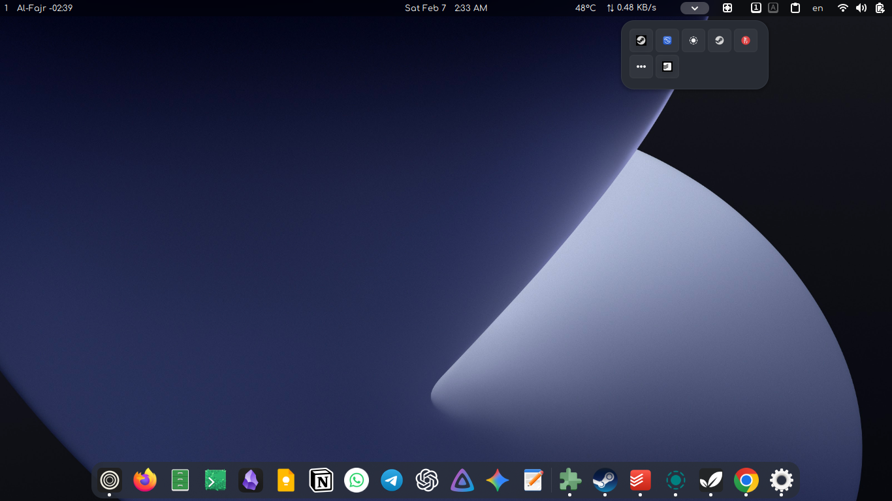
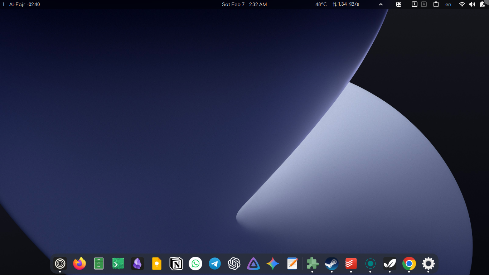
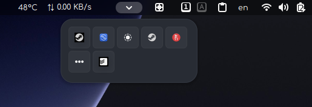

# Tray Dropdown (GNOME Shell Extension)

This is a simple GNOME Shell extension that collects system tray / status icons into a single dropdown menu, similar to how it works in KDE Plasma or Windows.

The goal of this extension is to reduce clutter in the top panel by grouping background app icons into one clean dropdown.

---

## ✨ Features

- Adds a dropdown button to the GNOME top panel
- Collects visible system tray / status icons
- Displays them inside a popup menu
- Lightweight and minimal design
- Built for GNOME Shell (tested on GNOME 49)

---

## 📸 Screenshots

### Tray dropdown menu open


### Tray dropdown with icons


### Top panel button



## ⚠️ Important Note

I have **zero prior experience** with GNOME Shell extension development.

This project was created as:
- A learning experiment
- A personal need for better tray management
- A proof that modern AI tools can help beginners build real things

---

## 🤖 How This Was Made

- I had **no background** in GNOME Shell, GJS, or Mutter internals
- The entire extension was built with the help of **Google AI Studio**
- The AI was used to:
  - Understand GNOME Shell APIs
  - Write and debug JavaScript (GJS) code
  - Fix runtime errors
  - Improve structure step by step

This extension would not exist without AI assistance.

---

## 🛠️ Current Limitations

- Some tray icons may not respond perfectly to clicks
- GNOME internals change frequently, so behavior may vary between versions
- This is still an early-stage / experimental extension

---

## 📦 Installation

### 1️⃣ Install from GNOME Extensions

You can install the extension directly from GNOME Extensions:

🔗 **GNOME Extensions link:**
👉 GNOME EXTENSIONS LINK

(Once the extension is approved and published)

---

### 2️⃣ Install manually from GitHub

You can also install the extension manually using the terminal.

#### Step 1: Clone the repository
```bash
git clone <https://github.com/iamirayman/tray-dropdown.git>
```
### Step 2: Copy the extension to GNOME extensions directory

```bash
cp -r tray-dropdown/tray-dropdown@amir ~/.local/share/gnome-shell/extensions/
```

### Step 3: Restart GNOME Shell

- **Xorg**: press `Alt + F2`, type `r`, then press Enter
- **Wayland**: log out and log in again

### Step 4: Enable the extension

```bash
gnome-extensions enable tray-dropdown@amir
```
---

## 🤝 Contributions

Contributions, fixes, and improvements are **very welcome**.

If you:
- Know GNOME Shell internals
- Want to improve click handling
- Want to clean up the code
- Or just want to experiment

Feel free to open an issue or submit a pull request.

---

## 📄 License

This project is open-source.
Use it, modify it, break it, improve it.

---

Made with curiosity, frustration, and a lot of AI help 🤖
